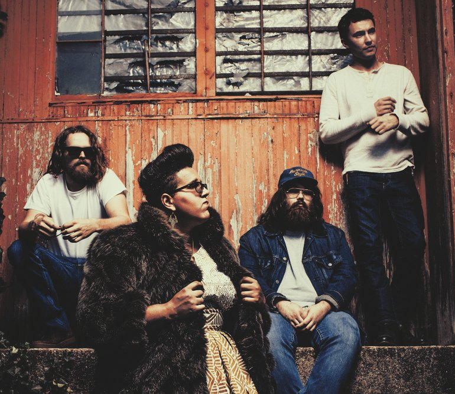

# Exercise 2: Markdown practice

---
## Instructions
Edit this Markdown document below to display:

- The name of your favorite band, and something about them
- An unordered list of what you think their top songs are
- An image of the band (which you should download from the web, and display)

----

## Alabama Shakes

The **Alabama Shakes** is a genre-bending band formed in Athens, Alabama in 2009. The band consists of lead singer and guitarist Brittany Howard, guitarist Heath Fogg, bassist Zac Cockrell, keyboard player Ben Tanner, and drummer Steve Johnson. The band went from playing in bars and clubs around the Southeast for two years while finding their sound and writing music. Now they are a highly nominated Grammy band, with a soulful punch.

#### TOP SONGS

- Sound & Color
- Hold On
- Don't Wanna Fight 
- Gimmie All Your Love
- Future People

